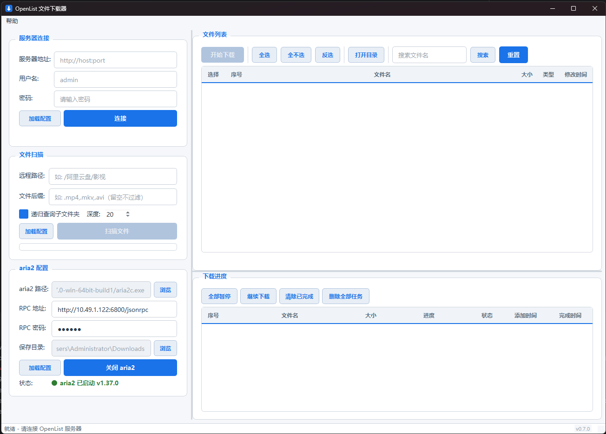

# OpenListDownloader


OpenList 文件下载器是一个基于 PyQt6 的桌面客户端，用于从 [OpenList](https://oplist.org/)（AList fork）网盘浏览和批量下载文件，通过 aria2 实现高速下载。

## 功能特性

- **服务器连接** — 支持 OpenList / AList v3 API，登录后自动管理 Token，过期自动重新登录；支持断开连接，断开前检测未完成任务并提醒
- **文件扫描** — 支持递归/非递归扫描远程目录，可自定义递归深度（1-20 层），支持按文件后缀过滤（如 `.mp4,.mkv`），后台线程运行不阻塞界面；递归开关和深度设置自动保存至配置；远程路径输入框双击弹窗编辑长路径，自动校验 Windows 文件系统非法字符
- **文件列表** — 支持全选、全不选、反选，实时显示选中文件数量和大小；重复下载时弹窗提醒用户；双击音频/视频文件可远程流式预览播放，图片文件用浏览器直接预览
- **下载进度** — 实时显示下载进度条、状态（等待中/下载中/已完成/失败）、添加时间和完成时间，支持点击表头排序；全部暂停/继续下载/清除已完成/删除全部任务按钮根据任务状态自动启用或禁用
- **aria2 集成** — 一键启动/关闭 aria2，通过 JSON-RPC 管理下载任务，支持批量添加；关闭前检测活跃任务并确认；一键打开下载目录
- **配置持久化** — 自动保存服务器地址、扫描路径、aria2 配置，支持一键加载
- **关于对话框** — 显示当前版本号，支持查看更新日志、在线检测更新（GitHub Releases），发现新版本后一键跳转下载
- **菜单栏** — 快速打开配置目录、日志目录，查看关于信息
- **日志归档** — 按天归档日志，自动清理 90 天以上的旧日志

## 截图



## 快速开始

### 环境要求

- Python 3.13+
- Windows 10/11
- [aria2](https://github.com/aria2/aria2)（可选，用于下载）

### 安装

```bash
git clone https://github.com/mayyu-w/OpenListDownloader.git
cd OpenListDownloader
pip install -r requirements.txt
```

### 运行

```bash
python main.py
```

### 使用步骤

1. **连接服务器** — 在「服务器连接」区域填写以下信息，点击「连接」
   - **服务器地址**：OpenList 服务地址，格式 `http://IP:端口`，例如 `http://10.49.1.35:5255`
   - **用户名**：OpenList 登录用户名，例如 `admin`
   - **密码**：对应密码
2. **配置 aria2** — 在「aria2 配置」区域填写以下信息，点击「启动 aria2」
   - **aria2 路径**：本地 `aria2c.exe` 的完整路径，例如 `D:\Tools\aria2\aria2c.exe`
   - **RPC 地址**：aria2 JSON-RPC 地址，格式 `http://IP:6800/jsonrpc`，本机默认 `http://localhost:6800/jsonrpc`
   - **RPC 密码**：与 aria2 启动参数 `--rpc-secret` 一致，未设置则留空
   - **保存目录**：文件下载保存的本地目录，例如 `D:\Downloads`
3. **扫描文件** — 在「文件扫描」区域填写以下信息，点击「扫描文件」
   - **远程路径**：OpenList 网盘中的目录路径，格式 `/驱动器/目录/子目录`，例如 `/阿里云盘/影视` 或 `/test/f1/doc1`
   - **文件后缀**：按后缀过滤，多个用英文逗号分隔，例如 `.mp4,.mkv,.avi`，留空则扫描全部文件
   - **递归查询子文件夹**：勾选后会递归扫描子目录，可设置递归深度（1-20 层）；取消勾选则仅扫描当前目录下的文件
4. **下载文件** — 在文件列表中勾选需要下载的文件，点击「开始下载」
5. **查看进度** — 在下载进度面板中实时查看下载状态（等待中/下载中/已完成/失败），完成后可点击「清空已完成」清理记录

## 项目结构

```
OpenListDownloader/
├── main.py                      # 应用入口
├── config.py                    # 全局常量
├── version.py                   # 版本号
├── requirements.txt             # 依赖
├── assets/                      # 图标资源
├── core/
│   ├── api_client.py            # OpenList API 客户端
│   ├── token_manager.py         # Token 生命周期管理
│   ├── file_scanner.py          # 递归文件扫描器
│   └── aria2_rpc.py             # aria2 JSON-RPC 封装
├── gui/
│   ├── main_window.py           # 主窗口
│   ├── login_widget.py          # 服务器连接面板
│   ├── file_list_widget.py      # 文件列表面板
│   ├── aria2_widget.py          # aria2 配置面板
│   ├── download_progress_widget.py  # 下载进度面板
│   ├── about_dialog.py          # 关于对话框
│   └── styles.py                # QSS 样式表
└── utils/
    ├── config_manager.py        # 配置持久化
    ├── format.py                # 格式化工具
    └── logger.py                # 日志管理
```

## 技术栈

- **GUI**: PyQt6
- **HTTP**: requests
- **下载引擎**: aria2 (JSON-RPC)
- **API**: OpenList / AList v3 REST API

## License

本项目基于 [MIT License](LICENSE) 开源。
